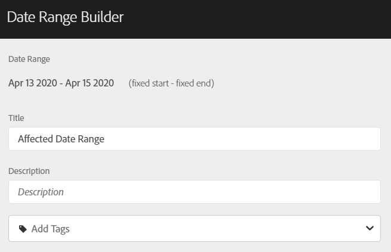
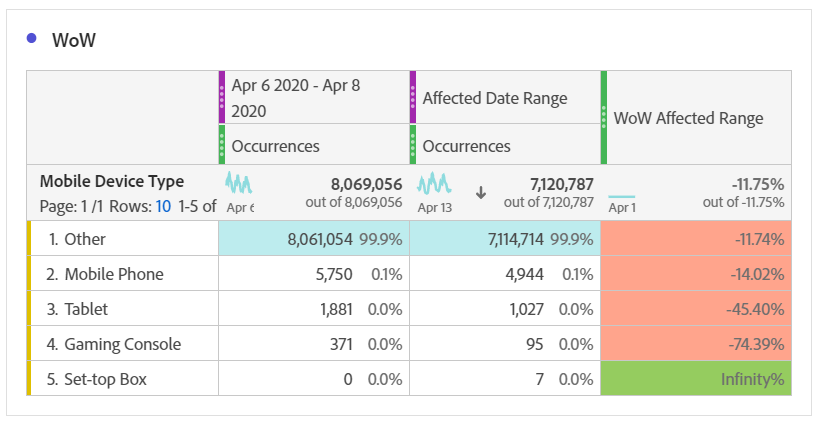

# 이벤트의 영향을 받은 날짜를 이전 범위와 비교

[이벤트의 영향을 받은 데이터](overview.md)가 있는 경우 이전 추세를 확인하여 영향을 측정할 수 있습니다. 이 비교는 이벤트가 데이터에 미치는 영향의 정도를 이해하는 데 유용합니다. 따라서 데이터를 제외할지, 보고서에 메모를 추가할지 또는 무시할지 여부를 결정할 수 있습니다.

## 이벤트를 포함하는 날짜 범위 만들기

이벤트를 포함하는 날짜 범위를 만들어 해당 이벤트의 영향을 살펴보기 시작합니다.

1. **[!UICONTROL 구성 요소]** > **[!UICONTROL 날짜 범위]**(으)로 이동합니다.
2. **[!UICONTROL 추가]**&#x200B;를 클릭합니다.
3. 이벤트가 발생한 날짜 범위를 선택합니다. **[!UICONTROL 저장]**&#x200B;을 클릭합니다.

   

## 이벤트 날짜 및 유사한 이전 범위를 나란히 보기

자유 형식 테이블 시각화를 사용하여 이벤트의 날짜 범위와 유사한 이전 날짜 범위 간의 지표를 비교할 수 있습니다.

1. Workspace 프로젝트를 열고 &#39;일&#39; 차원을 자유 형식 테이블에 추가합니다. &#39;발생 횟수&#39;와 같이 최근 생성된 날짜 범위를 지표에 스택하여 적용합니다.

   

2. 날짜 범위를 마우스 오른쪽 단추로 클릭한 다음 **[!UICONTROL 기간 열 추가]** > **[!UICONTROL 이 날짜 범위에 사용자 지정 날짜 범위 추가]**&#x200B;를 클릭합니다.
   * 주별 비교를 위해 이벤트의 범위에서 7일을 뺀 범위를 선택합니다. 이벤트와 이 날짜 범위 사이의 요일이 정렬되었는지 확인합니다.
   * 월별 비교를 위해 지난달 이벤트 범위를 선택합니다. 요일을 맞추려면 이벤트 범위에서 28일을 뺀 값을 선택할 수도 있습니다.
   * 연도별 비교에 대해 작년 이벤트 범위를 선택합니다.
3. 원하는 날짜 범위를 선택하면 자유 형식 테이블에 추가됩니다. 마우스 오른쪽 버튼을 클릭하고 비교하려는 만큼 날짜 범위를 추가할 수 있습니다.

   

## 이벤트와 유사한 이전 범위 간의 퍼센트 차이 계산

자유 형식 테이블 시각화를 사용하여 이벤트의 날짜 범위와 유사한 이전 날짜 범위 간에 차원 항목을 비교합니다. 이 단계는 따를 수 있는 주 단위 예제를 보여 줍니다.

1. Workspace 프로젝트를 열고 **시간이 아닌 차원**&#x200B;을(를) 자유 형식 테이블에 추가합니다. 예를 들어 &#39;모바일 디바이스 유형&#39; 차원을 사용할 수 있습니다. &#39;발생 횟수&#39;와 같이 최근 생성된 날짜 범위를 지표에 스택하여 적용합니다.

   영향을 받는 날짜 범위별 

2. 날짜 범위를 마우스 오른쪽 단추로 클릭한 다음 **[!UICONTROL 기간 비교]** > **[!UICONTROL 사용자 지정 날짜 범위를 이 날짜 범위와 비교]**&#x200B;를 클릭합니다. 이벤트의 범위에서 7일을 뺀 범위를 선택합니다. 이벤트와 이 날짜 범위 사이의 요일이 정렬되었는지 확인합니다.

   

3. 결과 &quot;백분율 변경&quot; 지표의 이름을 &quot;WoW 영향을 받는 범위&quot;와 같이 보다 구체적으로 바꿉니다. 정보 아이콘을 클릭한 다음 연필 편집을 클릭하여 지표 이름을 편집합니다.

   

4. 월별 및 연도별 비교에 대해 3단계와 4단계를 반복합니다. 이 작업은 동일한 테이블이나 별도의 테이블에서 수행할 수 있습니다.

## 비교 날짜 범위를 행으로 나란히 분석

위의 백분율 변경 사항을 추가로 분석하려는 경우 해당 변경 사항을 행으로 변환할 수 있습니다.

1. 자유 형식 테이블 시각화를 추가하고 테이블 빌더를 활성화합니다. 이 작업을 통해 퍼센트 변경 지표를 원하는 순서로 배치할 수 있습니다.
2. `Ctrl`(Windows) 또는 `Cmd`(Mac)을 길게 누르고 3% 변경 지표를 한 번에 하나씩 테이블의 행으로 드래그합니다.

   

3. 표의 열에 &#39;모든 방문 수&#39; 세그먼트를 추가하고 다른 원하는 세그먼트를 추가합니다.

   

4. **[!UICONTROL 빌드]**&#x200B;를 클릭합니다. 결과 테이블에서 원하는 세그먼트에 대한 이전 주, 월 및 년과 비교하여 영향을 받는 범위를 볼 수 있습니다.

   
