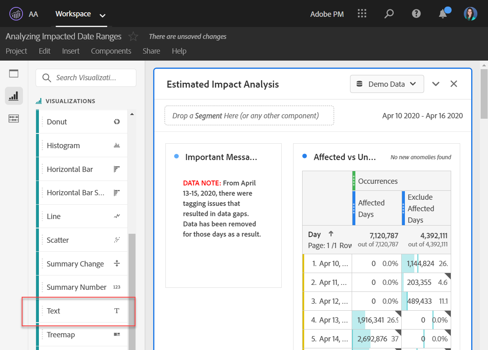
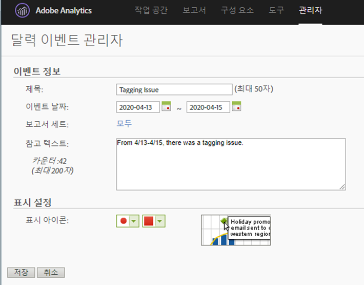

# 사용자에게 미치는 영향 전달

이벤트의 [영향을 받는 데이터가](../event-impacted.md)있는 경우 조직의 사용자에게 해당 이벤트를 전달해야 합니다. 다음 섹션에서는 조직의 사용자와 통신할 수 있는 다양한 방법을 보여 줍니다.

## 패널 또는 시각화 설명을 통해 커뮤니케이션

조직 내 사용자 간에 Workspace 프로젝트를 공유하는 경우 패널 또는 시각화 설명을 통해 이벤트의 영향을 알릴 수 있습니다. 패널 또는 시각화 헤더를 마우스 오른쪽 단추로 클릭한 다음 **[!UICONTROL Edit description]**&#x200B;선택합니다.

## 텍스트 시각화를 통한 커뮤니케이션

또한 전용 텍스트 시각화를 통해 이벤트의 영향을 통신할 수 있습니다. See [Text visualizations](/help/analyze/analysis-workspace/visualizations/text.md) in the Analyze user guide.

## 보고 및 분석에서 달력 이벤트 사용

보고 및 분석을 사용하는 경우 [달력 이벤트를](/help/components/t-calendar-event.md) 사용하여 트렌드 보고서에서 영향을 받는 일을 강조 표시할 수 있습니다. 이 메서드는 분석 작업 공간에 적용되지 않습니다.

1. > **[!UICONTROL Components]** 으로 **[!UICONTROL Calendar events]**&#x200B;이동합니다.
2. 원하는 제목, 날짜 범위 및 노트 텍스트를 입력합니다.
3. 클릭 **[!UICONTROL Save]**.

