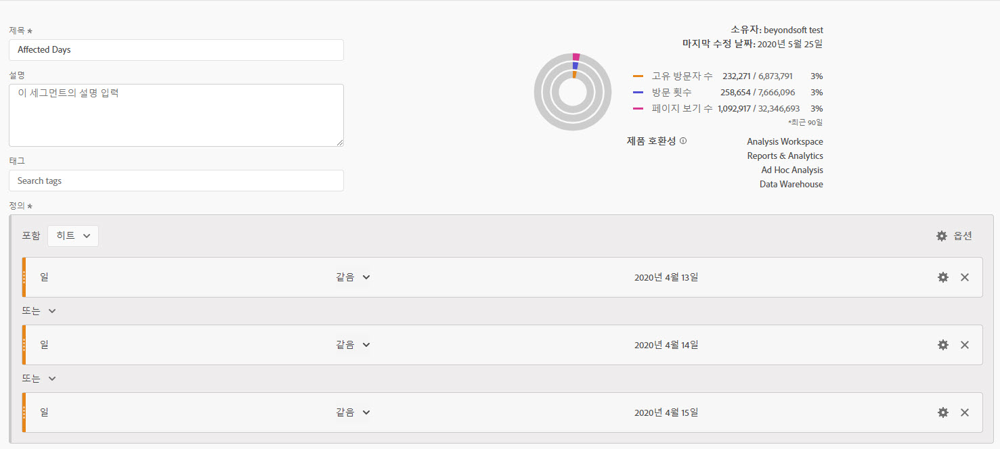
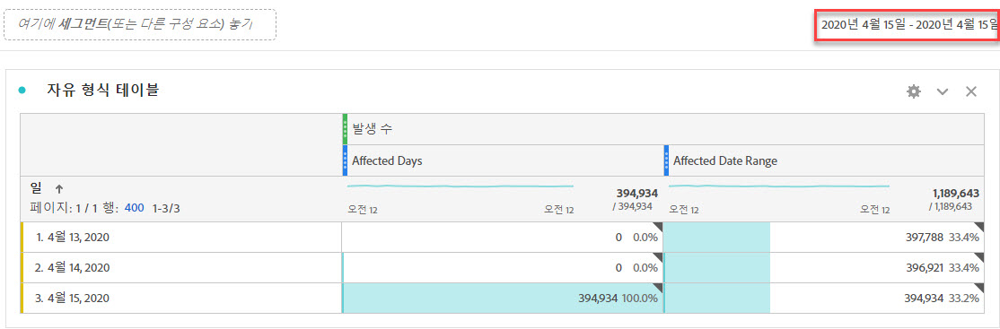
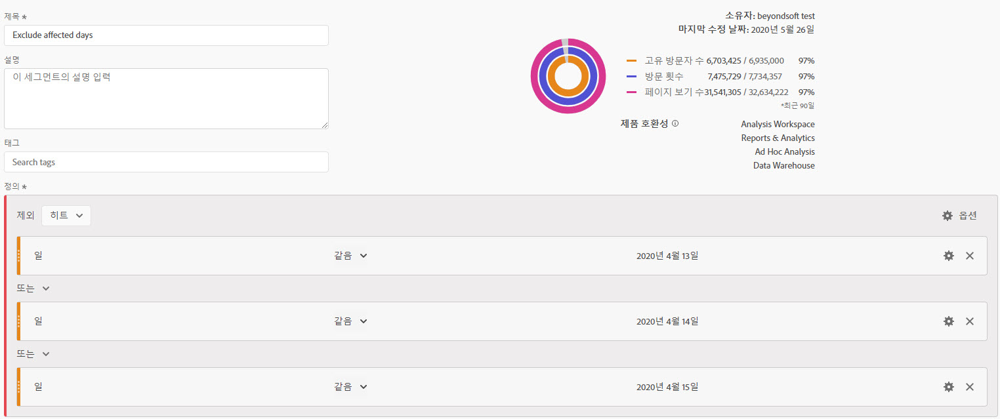
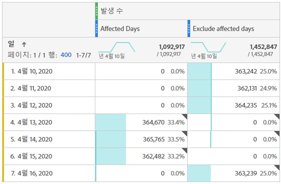
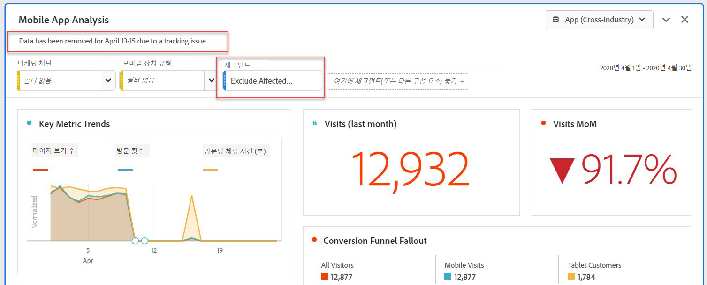
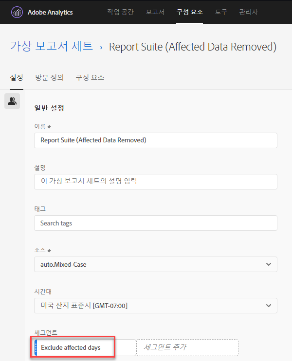

# 분석에서 특정 날짜 제외

데이터가 있는 경우 [이벤트의 영향을 받습니다](overview.md), 세그먼트를 사용하여 보고서에 포함하지 않으려는 날짜 범위를 제외할 수 있습니다. 이벤트 영향을 받은 날짜를 세그먼트화하면 조직에서 부분 데이터를 결정하지 못하도록 할 수 있습니다.

## 영향을 받는 일 수 분리 {#isolate}

영향을 받는 일 또는 날짜 범위를 구분하는 세그먼트를 만듭니다. 이 세그먼트는 영향을 받는 부분에 대한 자세한 정보를 보기 위해 문제 요일에 집중하려는 경우 유용합니다.

1. 다음 위치로 이동하여 세그먼트 빌더를 엽니다. **[!UICONTROL 구성 요소]** > **[!UICONTROL 세그먼트]**&#x200B;를 클릭한 다음 **[!UICONTROL 추가]**.
2. 일 차원을 정의 캔버스로 드래그하고 분리하려는 날짜와 동일하게 설정합니다.
3. 보고서에서 분리하려는 매일 위의 단계를 반복합니다.

>[!TIP]
>
>OR 문을 AND 문으로 변경하려면 OR 옆에 있는 아래쪽 화살표를 클릭하고 AND를 선택합니다.

Adobe은 자주색 날짜 범위 구성 요소가 아니라 주황색 차원 구성 요소를 사용하는 것을 권장합니다. 자주색 날짜 범위 구성 요소를 사용하는 경우 프로젝트의 달력 범위를 무시합니다.

## 영향을 받는 일 수 제외 {#exclude}

영향을 받는 일 또는 날짜 범위를 제외하는 세그먼트를 만듭니다. 이 세그먼트는 문제가 발생한 일수를 제외하여 전체 보고에 미치는 영향을 최소화하려는 경우 유용합니다.

1. 다음 위치로 이동하여 세그먼트 빌더를 엽니다. **[!UICONTROL 구성 요소]** > **[!UICONTROL 세그먼트]**&#x200B;를 클릭한 다음 **[!UICONTROL 추가]**.
2. 세그먼트 정의 캔버스의 오른쪽 상단에서 **[!UICONTROL 옵션]** > **[!UICONTROL 제외]**.
3. 일 차원을 정의 캔버스로 드래그하고 제거할 날짜와 동일하게 설정합니다.
4. 보고서에서 제거하려는 매일 위의 단계를 반복합니다.

## 보고서에서 이러한 세그먼트 사용

제외 세그먼트를 만들었으면 다른 세그먼트를 사용할 때와 동일하게 사용할 수 있습니다.

### 트렌드 보고서에서 세그먼트 비교 {#compare}

보고서에서 &#39;영향을 받는 일 수&#39; 세그먼트와 &#39;영향을 받는 일 제외&#39; 세그먼트를 모두 적용하여 나란히 비교할 수 있습니다. 두 세그먼트를 지표 위나 아래에 드래그하여 비교할 수 있습니다.

표 또는 시각화에 0을 표시하지 않으려면(dips가 발생함) **[!UICONTROL 0을 값 없음으로 해석]** 열 설정에서 을 선택합니다.

표 또는 시각화에 0을 표시하지 않으려면(dips가 발생함) **[!UICONTROL 0을 값 없음으로 해석]** 열 설정에서 을 선택합니다.

### 프로젝트에 제외 세그먼트 적용 {#apply}

영향을 받는 일 수 제외 세그먼트를 Workspace 프로젝트에 적용할 수 있습니다. 제외 세그먼트를 레이블이 지정된 작업 공간 캔버스 섹션으로 드래그합니다. *여기에 세그먼트 놓기*.

>[!TIP]
>
>보고서를 보는 데 도움이 되도록 패널의 설명에 제외된 데이터에 대한 메모를 포함합니다. 패널의 제목을 마우스 오른쪽 단추로 클릭한 다음 **[!UICONTROL 설명 편집]**.

### 가상 보고서 세트에서 제외 세그먼트 사용 {#use-vrs}

에서 세그먼트를 사용할 수 있습니다 [가상 보고서 세트](/help/components/vrs/vrs-about.md) 를 추가하여 데이터를 보다 편리하게 제외할 수 있습니다. 이 옵션은 영향을 받는 날짜 범위를 포함하는 각 보고서에 대해 세그먼트를 적용할 필요가 없다는 점에 이상적입니다. 가상 보고서 세트를 이미 기본 데이터 소스로 사용하는 경우 세그먼트를 기존 VRS에 추가할 수 있습니다.

1. 다음으로 이동 **[!UICONTROL 구성 요소]** > **[!UICONTROL 가상 보고서 세트]**.
2. **[!UICONTROL 추가]**&#x200B;를 클릭합니다.
3. 가상 보고서 세트에 대해 원하는 이름과 설명을 입력합니다.
4. 제외 세그먼트를 레이블이 지정된 영역으로 드래그합니다. **[!UICONTROL 세그먼트 추가]**.
5. 클릭 **[!UICONTROL 계속]** 오른쪽 상단에서 을 클릭하고 **[!UICONTROL 저장]**.

