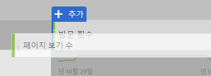
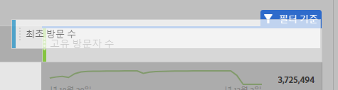
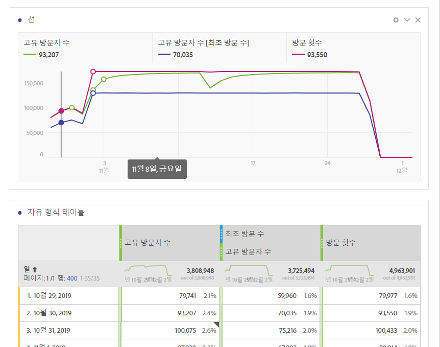
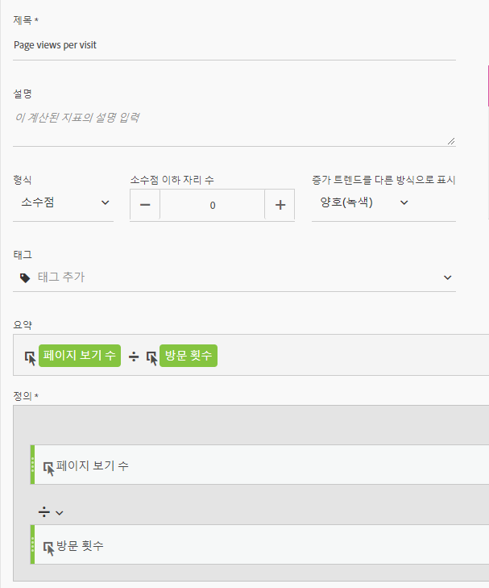
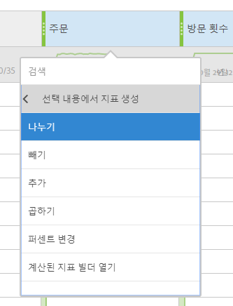

# 기타 플랫폼 번역 사이트에서 일반적으로 사용되는 지표

Google Analytics와 같은 다른 플랫폼에서 많은 보고서는 일반적인 지표 수를 공유합니다. 이 페이지를 사용하여 많은 보고서에서 사용되는 지표를 다시 만드는 방법을 이해하십시오.

작업 공간 자유 형식 표에 여러 지표를 추가하려면 작업 공간의 지표 헤더 옆에 있는 구성 요소 영역에서 지표를 드래그합니다.

## 획득 지표

**사용자는** 작업 영역의 **고유 방문자 수와** 거의 같습니다. See the [Unique Visitors](../../../components/c-variables/c-metrics/metrics-unique-visitors.md) metric in the Components user guide for additional details.

**새 사용자는** 다음 방법으로 얻을 수 있습니다.

1. **고유 방문자** 수 지표를 작업 공간으로 드래그합니다.
2. Drag the **First Time Visits** segment above the Unique Visitors metric headers:

   

**세션은** 분석 작업 공간의 **방문 횟수와** 거의 같습니다. See the [Visits](../../../components/c-variables/c-metrics/metrics-visit.md) metric in the Components user guide for additional details.

## 행동 지표

**바운스 비율을** 지표로 분석 작업 공간에서 즉시 사용할 수 있습니다. See the [Bounce Rate](../../../components/c-variables/c-metrics/metrics-bounce-rate.md) metric in the Components user guide for additional information.

**페이지/세션은** 계산된 지표입니다. 다음을 통해 얻을 수 있습니다.

1. 이미 계산된 지표를 만든 경우 지표 아래에서 찾은 다음 작업 공간으로 드래그합니다.
2. If you have not yet created this calculated metric, click the **+** icon near the metric list to open the Calculated Metric Builder.
3. &#39; 방문당 페이지 보기 횟수&#39;및 원하는 경우 설명을 지정합니다.
4. 형식을 Decimal로 설정하고 소수점 이하 자릿수를 2로 설정합니다.
5. **페이지 보기** 지표 및 **방문** 횟수 지표를 정의 영역으로 드래그합니다.
6. Arrange the definition so the formula is **Page Views divided by Visits**.

   

7. 저장을 클릭하여 작업 영역으로 돌아갑니다.
8. 새로 정의된 계산된 지표를 작업 공간으로 드래그합니다.

   Learn more about [Calculated Metrics](../../../components/c-variables/c-metrics/calculated-metric.md) in the Components user guide.

**평균 Session Duration** is approximately equal to **Time Spent per Visit (seconds)**. Learn more about [Time Spent](../../../components/c-variables/c-metrics/metrics-time-spent.md) metrics in the Components user guide.

## 전환 지표

**목표 전환율**, **목표 완료** 및 **목표 값은** 두 플랫폼에서 추가 구현이 필요합니다. 구현에서 이미 제품 차원과 구매 이벤트를 수용하는 경우 다음 단계를 고려하십시오.

1. **주문** 지표, **매출** 지표 및 **방문** 횟수 지표를 작업 공간으로 드래그합니다.
1. Create a calculated metric of **Orders per Visit**. 두 지표 헤더 모두에서 Ctrl 키 (Windows) 또는 Cmd 키 (Mac) 를 누른 상태로 클릭하면 강조 표시됩니다. Right-click one of the headers, select **Create Metric From Selection**, then click **Divide**. 이 새 지표는 목표 전환율과 유사합니다.
1. 소수점 자릿수가 필요한 경우 계산된 지표를 편집합니다. 지표 머리글에서 정보 단추를 클릭한 다음 연필 아이콘을 클릭합니다. 계산된 지표 빌더 창에 1 개 또는 2 개의 소수 자리를 추가한 다음 저장을 클릭합니다.

   

구현에서 아직 제품 또는 전환 데이터를 수용하지 않는 경우, 구현 컨설턴트와 함께 데이터 품질과 무결성을 보장하는 것이 좋습니다.
