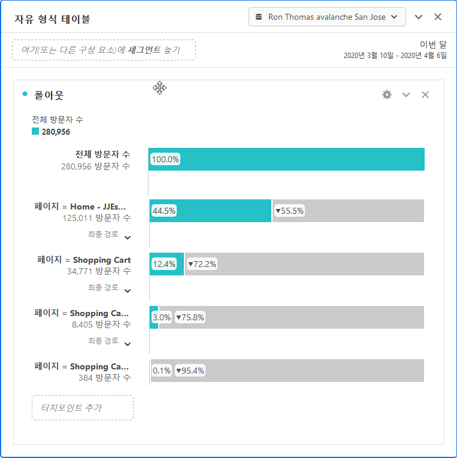

# 전환 보고서

' 전환'은 방문자가 조직의 주요 지표로 직접 전환하는 사이트입니다. 전환 보고서는 방문자가 전환하는 방법에 대한 세부 사항을 보여줍니다.

이 페이지에서는 사용자가 분석 작업 공간 사용에 대한 기본적인 지식을 가지고 있다고 가정합니다. See [Create a basic report in Analysis Workspace for Google Analytics users](create-report.md) if you are not yet familiar with the tool in Adobe Analytics.

## 목표 보고서

목표는 Google Analytics 사용자에게 웹 사이트 전환을 정의하는 방법을 제공합니다. 기본 방법으로 펀넬, 역행동, 멀티채널 펀넬 및 속성을 만들 수 있습니다. Google Analytics의 목표는 소급 적용되지 않으며 관리 페이지에서만 설정할 수 있습니다. 또한 페이지, 이벤트, 체류 시간 또는 평균 페이지 수만 기반으로 합니다.

Adobe Analytics 에서는 지표가 컨텍스트에서 적용될 수 있으므로 목표 개념이 필요하지 않습니다. 구현에서 추적할 이벤트를 수용하는 한 전환 보고서를 수정하고 내역 데이터에 대한 결과를 즉시 얻을 수 있습니다.

### 단계 시각화

단계 시각화 보고서를 통해 분석가는 전환에 필요한 특정 일련의 단계에 집중할 수 있습니다. 예를 들어 구입을 하기 전에 전자 상거래 사이트의 방문자는 장바구니, 대금 청구 및 배송 페이지, 지불 페이지 및 주문 검토 페이지에 액세스해야 합니다.

분석 작업 공간에서 폴아웃 시각화를 사용하여 이 데이터를 볼 수 있습니다.

1. 왼쪽의 시각화 아이콘을 클릭하고 폴아웃 시각화 기능을 자유 형식 테이블 위의 작업 영역으로 드래그합니다.
2. Click the components icon on the left, then locate the **Pages** dimension.
3. 페이지 값 옆에 있는 화살표 아이콘을 클릭하여 페이지 값을 표시합니다. 차원 값은 노란색으로 표시됩니다.
4. 원하는 페이지를 찾아 첫 번째 터치포인트로 사용하고 시각화의'터치포인트 추가'레이블이 지정된 공간으로 드래그합니다.
5. 페이지 값을 시각화로 드래그하여 원하는 터치포인트를 계속 추가합니다.

폴아웃 시각화는 페이지 차원에만 국한되지 않습니다. 모든 차원, 지표 또는 세그먼트를 사용하여 조직의 요구 사항에 맞게 폴아웃 보고서를 구성할 수 있습니다.

## 전자 상거래 보고서

전자 상거래 보고서는 일반적으로 제품 또는 서비스를 판매하는 사이트에서 사용되며 구매한 항목에 대한 주문 및 매출을 측정합니다. 이 기능은 Adobe Analytics에서 사용할 수 있으며 제품 보고서라고 합니다.

Adobe Analytics의 Google 분석 및 제품 보고서에서 전자 상거래 보고서를 사용하려면 사용자 지정 구현이 변경되어야 합니다. See the [Products](../../../components/c-variables/dimensionslist/reports-products.md) dimension in the Components user guide for more information.

## 다중 채널 단계 보고서

다중 채널 단계 보고서는 획득 보고서가 제공하는 내용 이외에 추가적인 마케팅 채널 데이터를 제공합니다. 이러한 보고서는 방문자가 사이트에 도달하는 방법 대신 방문자가 전환하는 방식에 중점을 둡니다.

> [!NOTE]
>
> Adobe Analytics에서 다중 채널 보고서를 사용하려면 제품 변수 및 구매 이벤트를 수용하도록 마케팅 채널과 사용자 지정 구현 설정이 모두 필요합니다. 이러한 기능이 보고서 세트에 대해 아직 구성되지 않은 경우 구현 컨설턴트와 함께 작업하는 것이 좋습니다.

### 멀티채널 - 지원 전환

지원 전환은 전환에 대해 각 채널이 지원하는 횟수를 보여줍니다. In Analysis Workspace, the **Order Assists** metric can be used.

1. In the Components menu, locate the **Marketing Channel** dimension and drag it onto the large freeform table area labeled 'Drop a Dimension here'.
2. Drag the **Order Assists** metric on top of the automatically created **Occurrences** metric header to replace it. 원할 경우 추가 지표를 작업 영역으로 끌 수 있습니다.

### 멀티채널 - 주요 전환 경로

상위 전환 경로 보고서는 사용자가 변환하기 전에 사용하는 상위 채널 경로를 보여줍니다. 분석 작업 공간에서는 흐름 보고서를 사용하여 상위 전환 경로를 시각화합니다.

1. 왼쪽에 있는 패널 아이콘을 클릭하고 자유 형식 테이블 위에 있는 속성 패널을 드래그합니다.
2. Click the Components icon on the left, locate the **Marketing Channel** dimension, and drag it to the box labeled 'Add Dimension'.
3. 지표 (예: 주문) 아래에서 원하는 전환 이벤트를 찾아'지표 추가'레이블이 표시된 상자로 드래그합니다. 계산된 지표는 기여도 패널에서 지원되지 않습니다.
4. 작성을 클릭합니다.
5. 결과 보고서에서'채널 흐름'시각화를 찾습니다. 이 흐름에는 방문자가 구매하기 전에 접촉한 상위 경로가 표시됩니다.

이러한 흐름 시각화는 대화형입니다. 각 채널을 클릭하여 어느 방향으로든 흐름을 확장합니다.

### 멀티채널 - 시간 지연

시간 지연 보고서는 방문자가 사이트에서 전환하는 데 걸리는 시간을 보여줍니다. In Analysis Workspace, this data is available using the **Days Before First Purchase** dimension. 올바르게 구현된 구매 이벤트의 컨텍스트에서만 사용할 수 있습니다.

1. In the Components menu, locate the **Days Before First Purchase** dimension and drag it onto the large freeform table area labeled 'Drop a Dimension here'.
2. Drag the desired metrics onto the workspace alongside the automatically created **Occurrences** metric. See the [Metric translation guide](common-metrics.md) for details on how to obtain each respective metric.

Adobe recommends using the **Orders**, **Units**, or **Revenue** metrics with this dimension.

For other types of conversions, including custom events, the **Time Prior to Event** dimension is available. 방문자가 방문 내에서 이벤트를 트리거하는 데 걸리는 시간을 분 단위로 보여줍니다.

1. In the Components menu, locate the **Time Prior to Event** dimension and drag it onto the large freeform table area labeled 'Drop a Dimension here'.
2. Drag the desired metrics onto the workspace alongside the automatically created **Occurrences** metric. See the [Metric translation guide](common-metrics.md) for details on how to obtain each respective metric.

Adobe 에서는 이 차원을 사용자 지정 이벤트 또는 구매 이벤트와 함께 사용할 것을 권장합니다.

### 멀티채널 - 경로 길이

경로 길이 보고서는 전환 이벤트 전에 접촉한 채널 수를 보여줍니다. 분석 작업 공간에서 속성 패널에는 시각화 중 하나에 이 데이터가 포함됩니다.

1. 왼쪽의 패널 아이콘을 클릭하고 자유 형식 테이블 위에 있는 속성 패널을 드래그합니다.
2. Click the Components icon on the left, locate the **Marketing Channel** dimension, and drag it to the box labeled 'Add Dimension'.
3. 지표 (예: 주문) 아래에서 원하는 전환 이벤트를 찾아'지표 추가'레이블이 표시된 상자로 드래그합니다. 계산된 지표는 기여도 패널에서 지원되지 않습니다.
4. 작성을 클릭합니다.
5. 결과 보고서에서, 여정 시각화의 터치포인트를 찾습니다. 이 히스토그램은 방문자가 구매하기 전에 접촉한 채널 수를 보여줍니다.
