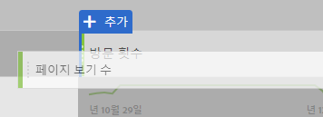

# Google Analytics 사용자를 위한 분석 작업 공간에서 기본 보고서 만들기

분석 작업 공간 (Adobe Analytics 내의 주요 기능 중 하나) 는 사용자가 수집한 데이터에 대한 통찰력을 얻을 수 있는 강력한 영역을 제공합니다. Google Analytics와 Adobe Analytics 간의 보고는 매우 다릅니다.

* Google Analytics의 보고 구조를 사용하면 지리적 위치 또는 참조 트래픽과 같은 특정 데이터 유형을 선택할 수 있습니다. 플랫폼은 미리 만들어진 보고 보기를 사용하여 해당 데이터를 보는 가장 좋은 방법을 기반으로 합니다.
* 분석 작업 공간의 보고 구조는 빈 캔버스를 제공하므로 보다 정확한 보고 요구 사항을 충족시킬 수 있습니다.

분석 작업 공간은 미리 제작된 보고서보다 캔버스와 유사하게 작동하므로 Google Analytics에서 보고서를 다시 만들면 올바른 시각화 및 구성 요소를 사용할 수 있습니다.

## 작업 영역에서 사용되는 주요 용어

* **패널은** 작업 영역의 중요 구성 요소입니다. 대부분의 시나리오에서는 자유 형식 패널이 사용됩니다.
* **시각화는** 모든 자유 형식 패널을 구성합니다. 이들의 목적은 데이터를 다른 형식으로 표현하는 것입니다. 대부분의 시간은 표지만 다른 시간에는 도넛이나 라인 차트와 같은 것이 될 수 있습니다. Google Analytics의 많은 보고서는 다음과 같은 두 가지 시각화로 구성됩니다. 라인 차트 및 자유 형식 테이블.
* **구성 요소는** 데이터를 반환하기 위해 시각화에 배치됩니다. 다양한 방식으로 구성 요소를 혼합하여 보고 요구 사항을 충족할 수 있습니다.
   * **차원은** 변수 값이며 일반적으로 텍스트를 포함합니다. 페이지 이름, 레퍼러 또는 지역 국가 등이 있습니다. 일반적으로 표는 표에서 행으로 나열됩니다.
   * **지표는** 일반적으로 이벤트 또는 일부 정렬의 전환을 나타냅니다. 예를 들어 페이지 보기와 같은 일반적인 이벤트나 구매 또는 등록과 같은 중요한 이벤트가 포함됩니다. 이것은 일반적으로 테이블에서 열로 간주되어 차원당 이벤트가 발생한 횟수를 보여줍니다.
   * **세그먼트는** 데이터의 하위 세트이며 Google Analytics의 세그먼트와 유사하게 동작합니다. 사용자 정의 필터를 사용하면 데이터의 특정 부분에 집중할 수 있습니다.
   * **날짜 범위를** 사용하면 이벤트가 발생했을 때 데이터를 구성할 수 있습니다. 시간 경과에 따른 트렌드의 중추적인 역할을 하며 일반적으로 지표와 쌍을 이루고 있습니다.

## 작업 공간에서 기본 보고서 만들기

올바른 구성 요소를 작업 공간 캔버스로 드래그하여 모든 페이지 보고서 (Google Analytics의 것과 유사) 를 만듭니다.

1. Log in to [experiencecloud.adobe.com](https://experiencecloud.adobe.com) using your Adobe ID credentials.
2. 오른쪽 상단의 9 개 사각형 아이콘을 클릭한 다음 컬러 분석 로고를 클릭합니다.
3. 위쪽 탐색 모음에서 작업 영역을 클릭합니다.
4. ' 새 프로젝트 만들기'버튼을 클릭합니다.
5. 모달 팝업에서'빈 프로젝트'가 선택되어 있는지 확인한 다음 만들기를 클릭합니다.
6. 왼쪽에는 차원, 지표, 세그먼트 및 날짜 범위가 표시됩니다. 페이지 차원 (주황색) 를 찾아'여기에 차원 놓기'레이블이 지정된 캔버스로 드래그합니다.
7. 이 달의 최상위 페이지를 보여주는 보고서를 볼 수 있습니다. Analysis Workspace automatically populates the report with the [Occurrences](../../../components/c-variables/c-metrics/metrics-occurrences.md) metric.
8. Google Analytics의 표에는 일반적으로 7-8 개의 지표가 포함됩니다. 바운스 비율 지표 (컬러 녹색) 를 찾아 발생 지표 머리글 옆에 드래그합니다. 발생 횟수 옆에 있는 바운스 비율 지표를 드래그하면 두 지표 모두 나란히 표시됩니다.
9. 기존 지표 헤더 옆에 있는 지표를 드래그하여 여러 지표를 나란히 배치할 수 있습니다. See [commonly used metrics](common-metrics.md) for information on how to obtain metrics typically used in Google Analytics.

   

## 작업 공간에서 미리 작성된 보고서 템플릿으로 시작

프로젝트 템플릿에 액세스하여 컨텐츠 소비 템플릿 (Google Analytics의 모든 페이지 보고서와 유사) 를 만듭니다.

1. ' 새 프로젝트 만들기'버튼을 클릭합니다.
2. 모든 템플릿 아래에 나열된'콘텐츠 소비 (웹)' 아이콘을 찾아 두 번 클릭합니다.
3. 미리 만들어진 각 시각화 탐색: 시작 페이지 흐름, 상위 페이지 테이블, 종료 페이지 흐름, 시작 사이트 섹션 흐름 및 최상위 사이트 섹션 테이블.

   

## 툴 사용

분석 작업 공간은 보고 도구이므로 데이터 수집에는 영향을 주지 않습니다. 어떤 효과가 있는지 보기 위해 구성 요소를 프로젝트로 과도하게 드래그하는 데에는 불합리한 영향이 없습니다. 차원 및 지표 조합을 작업 영역 프로젝트로 드래그하여 사용할 수 있는 항목을 확인합니다.

실수로 잘못된 구성 요소를 작업 영역 프로젝트로 드래그하거나 단계로 돌아가려면 Ctrl + Z (Windows) 또는 Cmd + Z (Mac) 를 눌러 마지막으로 수행한 작업을 실행 취소합니다. You can also start with a clean slate by clicking *[!UICONTROL Project]&gt;[!UICONTROL New]* in the upper left menu.

Adobe는 마우스 오른쪽 단추 클릭 컨텍스트 메뉴의 분석 작업 공간에 많은 기능을 추가했습니다. 대부분의 시각화 및 구성 요소를 마우스 오른쪽 단추로 클릭하여 보다 세부적인 분석 및 상호 작용을 수행할 수 있습니다. 작업 영역에서 구성 요소를 마우스 오른쪽 단추로 클릭하면 사용할 수 있는 옵션이 표시됩니다.

## 사용할 차원 및 지표 이해

분석 작업 공간에 익숙하고 Google Analytics에서 일반적으로 본 특정 보고서를 다시 만들려면 해당 페이지에 대한 보고서를 찾습니다.

* [실시간 보고서](realtime-reports.md)
* [대상 보고서](audience-reports.md)
* [획득 보고서](acquisition-reports.md)
* [동작 보고서](behavior-reports.md)
* [전환 보고서](conversions-reports.md)
