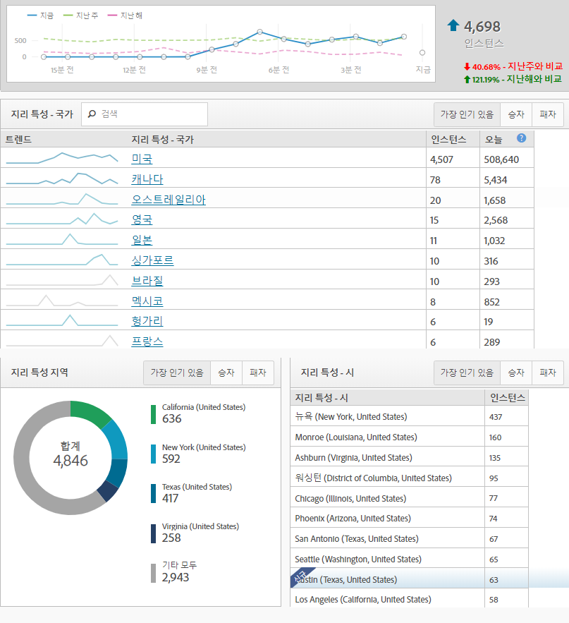
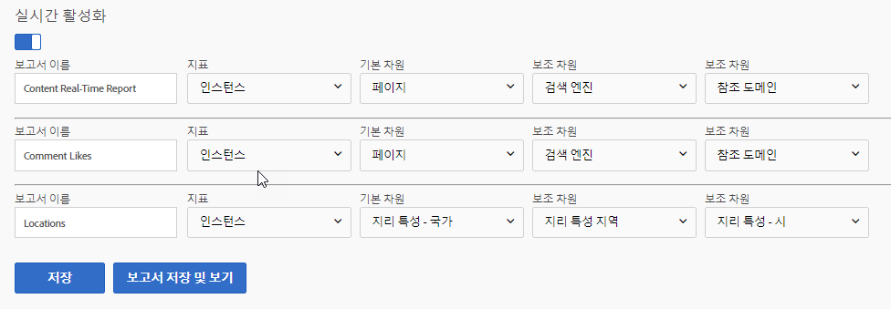

# 실시간 보고서

실시간 보고서는 현재 사이트에서 일어나고 있는 상황을 보여줍니다. 이러한 유형의 보고서는 사이트의 업데이트 결과를 즉시 확인하는 데 유용합니다. 예를 들어 블랙프라이데이 판매를 시작한 회사는 특정 페이지에 대한 트래픽을 측정하고 해당 시점에 실적을 기반으로 우선 순위를 정할 판매량을 결정할 수 있습니다.

실시간 보고서는 분석 작업 공간에 아직 소개되지 않은 몇 가지 기능 중 하나입니다. 보고 및 분석을 사용하여 이 데이터를 얻습니다. 데이터 수집을 시작하려면 간단한 구성이 필요합니다.

실시간 보고서 구성 페이지에 액세스하려면 (관리자 권한 필요):

1. Click [!UICONTROL Reports] in the Adobe Analytics header navigation.
2. In the left menu, Click *[!UICONTROL Site Metrics]* &gt; *[!UICONTROL Real-Time]*.
3. 보고서 세트에 아직 실시간 활성화가 활성화되어 있지 않으면 보고서 세트를 구성하기 위한 링크와 함께 메시지가 표시됩니다. If the report suite has real-time enabled, click [!UICONTROL Configure] near the real-time report's title.

Adobe 에서는 최대 3 개의 실시간 보고서를 통해 데이터를 동시에 수집할 수 있습니다. 각 구성 요소는 실시간으로 데이터를 수집하기 전에 구성해야 합니다.

## 실시간 위치

실시간 위치는 현재 순간에 사이트를 방문하는 동안 방문자가 거주하고 있는 곳을 알려줍니다. 위치 데이터를 표시하도록 3 개의 실시간 보고서 중 하나를 구성하려면:

1. Click [!UICONTROL Configure] near the real-time report's title.
2. 실시간 보고서 슬롯 중 하나 아래:
   * 실시간 보고서의 이름을 지정합니다. 예: "locations".
   * 인스턴스는 일반적으로 지표로 사용됩니다. 사용자/고유 방문자는 현재 실시간 보고서에서 사용할 수 없습니다.
   * 기본 차원의 경우 지리 특성 국가가 일반적으로 사용됩니다. 지리 특성 지역, 지리 특성 미국 DMA 및 지리 특성 도시를 사용할 수도 있습니다.
   * 2 차 차원에 대해, 이 트래픽에 대해 보고자 하는 기본 추가 데이터를 사용합니다. 보조 차원은 위치에만 지정할 필요는 없습니다.
3. Click [!UICONTROL Save and View Report].

## 실시간 트래픽 소스

실시간 트래픽 소스는 현재 순간에 사이트를 방문하는 동안 방문자가 있었던 곳을 알려줍니다. 트래픽 소스 데이터를 표시하도록 3 개의 실시간 보고서 중 하나를 구성하려면:

1. 실시간 보고서 제목 근처에'구성'을 클릭합니다.
2. 실시간 보고서 슬롯 중 하나 아래:
   * 실시간 보고서의 이름을 지정합니다. 예: "Traffic Sources".
   * 인스턴스는 일반적으로 지표로 사용됩니다. 사용자/고유 방문자는 현재 실시간 보고서에서 사용할 수 없습니다.
   * 기본 차원의 경우 일반적으로 참조 도메인이 사용됩니다. 검색 엔진 및 검색 키워드도 사용할 수 있습니다.
   * 2 차 차원에 대해, 이 트래픽에 대해 보고자 하는 기본 추가 데이터를 사용합니다. 보조 차원은 트래픽 소스에만 국한되지 않아도 됩니다.
3. Click [!UICONTROL Save and View Report].

## 실시간 컨텐츠

실시간 컨텐츠는 방문자가 현재 보고 있는 페이지를 알려줍니다. 컨텐츠 데이터를 표시하도록 3 개의 실시간 보고서 중 하나를 구성하려면:

1. Click [!UICONTROL Configure] near the real-time report's title.
2. 실시간 보고서 슬롯 중 하나 아래:
   * 실시간 보고서의 이름을 지정합니다. 예: "content".
   * 인스턴스는 일반적으로 지표로 사용됩니다. 사용자/고유 방문자는 현재 실시간 보고서에서 사용할 수 없습니다.
   * 기본 차원의 경우 일반적으로 페이지가 사용됩니다. 구현에서 이러한 변수를 정의하는 경우에도 사이트 섹션 및 서버를 사용할 수 있습니다.
   * 2 차 차원에 대해, 이 트래픽에 대해 보고자 하는 기본 추가 데이터를 사용합니다. 보조 차원은 컨텐츠에 지정할 필요가 없습니다.
3. Click [!UICONTROL Save and View Report].

## 실시간 이벤트

실시간 이벤트는 사이트에서 가장 많이 발생하는 이벤트를 알려줍니다. Google Analytics에서 이벤트는 특정 작업 (일반적으로 페이지 뷰와 관련이 없는 동작) 이 발생한 횟수를 캡처합니다. GA 이벤트는 카테고리, 레이블 및 동작으로 전송됩니다. Adobe Analytics에서 사용자 지정 이벤트는 관리 콘솔에서 친숙한 이름이 지정되는 지표이며 모든 차원과 함께 분석할 수 있습니다. Google Analytics 이벤트와 유사한 Adobe Analytics의 차원을 찾는 경우, 종종 페이지 보기와 관련이 없는 데이터 수집을 위해 다목적 캐치 (catch-all) 로 사용되는 사용자 지정 링크 차원 적용을 고려합니다 (종료 링크 - 종료 링크 및 다운로드 링크 포함).

> [!NOTE] 실시간 보고서에서 사용자 지정 이벤트를 사용할 때는 사용자 지정 이벤트와 동일한 히트에 차원 값을 정의해야 합니다. 예를 들어'참조 도메인'차원에 대한'등록'사용자 지정 이벤트를 보는 경우 추가 구현 없이 데이터가 반환되지 않습니다. 참조 도메인은 첫 번째 히트에만 나타나고 사용자 지정 이벤트는 일반적으로 방문 후반부에 나타나므로, 데이터는 실시간 보고서에서 연결할 수 없습니다. 이 데이터는 표준 처리 지연 (일반적으로 30-90 분) 를 사용하는 분석 작업 공간을 사용하여 사용할 수 있습니다.

## 실시간 전환

실시간 전환은 플랫폼 간에 데이터를 다르게 표시합니다. Google Analytics의 목표는 Adobe Analytics의 지표 및 성공 이벤트와 유사합니다. Adobe Analytics (성공 이벤트와 같은 사용자 지정 지표 및 매출 같은 표준 지표 모두) 에서 대부분의 지표를 실시간 보고서에서 사용할 수 있습니다. Google Analytics와 유사하게, 제품 이름, 추적 코드 및 캠페인 성과와 같은 차원을 실시간 보고서에서 적용할 수도 있습니다.

1. Click [!UICONTROL Configure] near the real-time report's title.
2. 실시간 보고서 슬롯 중 하나 아래:
   * 실시간 보고서의 이름을 지정합니다. 예: "전환".
   * 인스턴스는 일반적으로 지표로 사용됩니다. 사용자/고유 방문자는 현재 실시간 보고서에서 사용할 수 없습니다.
   * 기본 차원의 경우 일반적으로 추적 코드가 사용됩니다. 제품 차원은 구현에서 사용하는 경우에도 사용할 수 있습니다.
   * 2 차 차원에 대해, 이 트래픽에 대해 보고자 하는 기본 추가 데이터를 사용합니다. 보조 차원은 전환 전용일 필요가 없습니다.
3. Click [!UICONTROL Save and View Report].

> [!NOTE] 인스턴스 외부의 이벤트 (예: 주문) 를 사용하는 경우 구현에서 동일한 히트에 대한 차원 및 이벤트를 정의하는지 확인합니다. 차원과 이벤트가 동일한 히트에서 실행되지 않는 경우 표준 처리 지연을 사용하는 분석 작업 공간에서 해당 데이터를 사용할 수 있습니다 (일반적으로 30-90 분).
