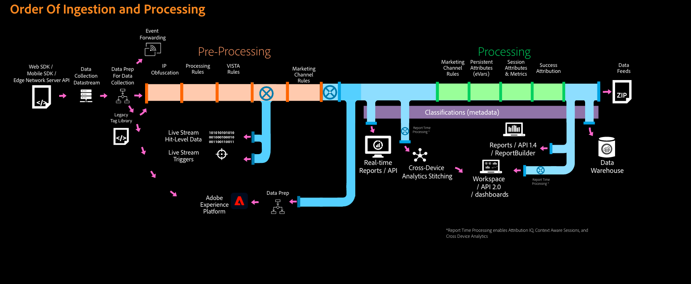

# Adobe Analytics의 데이터 처리 순서

Adobe 에서는 데이터가 보고에 표시되기 전에 데이터를 변경하거나 조작하는 다양한 방법을 제공합니다. 이 페이지에는 다양한 Adobe Analytics 기능이 데이터를 처리하는 순서가 표시됩니다. 이 목록을 사용하여 데이터 불일치를 해결하거나 데이터 조정이 필요할 때 사용할 최상의 기능을 결정할 수 있습니다.

## Adobe으로 전송되기 전의 데이터

데이터가 Adobe으로 전송되기 전에 일반적으로 다음 방법 중 하나를 사용하여 클라이언트측에 컴파일됩니다.

* **AppMeasurement**: 사이트에서 호스팅되고 각 페이지에서 참조되는 JavaScript 파일입니다. 데이터는 Adobe Analytics으로 직접 전송됩니다.
* **Adobe Experience Platform Web SDK**: 사이트에서 호스팅되고 각 페이지에서 참조되는 JavaScript 파일입니다. 데이터가 Adobe Experience Edge로 전송됩니다.
* **Adobe Experience Cloud 데이터 컬렉션의 태그**: 데이터 수집 UI 내에서 생성된 규칙을 포함하는 각 페이지에서 참조되는 JavaScript 파일입니다. Adobe Analytics 확장은 AppMeasurement를 보다 쉽게 구현하는 방법을 제공합니다. 웹 SDK 확장은 웹 SDK를 쉽게 구현하는 방법을 제공합니다.

데이터를 Adobe Experience Edge로 전송하는 경우 데이터를 Adobe Analytics(기타 많은 Adobe Experience Cloud 솔루션)에 전달하도록 구성할 수 있습니다. 구현 방법과 관계없이 궁극적으로 원하는 변수를 사용하는 이미지 요청이 Adobe 데이터 수집 서버로 전송됩니다.

## Adobe Analytics 데이터 수집 서버에 도착하는 데이터

데이터가 Adobe Analytics에 도착하면 다음 기능은 필요에 따라 데이터를 조정합니다.

1. **조회 테이블**: Adobe 내부 조회 테이블(예: [브라우저](/help/components/dimensions/browser.md) 차원)이 해당 값과 일치합니다.
2. [**동적 변수**](/help/implement/vars/page-vars/dynamic-variables.md): 이미지 요청의 어떤 부분에서도 동적 변수가 표시된다면 값이 복사되어 앞으로 나가는 독립적인 값으로 처리됩니다.
3. [**보트 규칙**](/help/admin/admin/bot-removal/bot-rules.md): 표준 또는 사용자 지정 보트 필터링을 적용하여 해당 데이터를 보고에서 제외합니다.
4. [**처리 규칙**](/help/admin/admin/c-processing-rules/processing-rules.md): 조직에서 데이터에 적용한 사용자 지정 규칙입니다. 의 매핑을 포함합니다 [컨텍스트 데이터 변수](/help/implement/vars/page-vars/contextdata.md) 를 각 변수에 추가합니다.
5. **VISTA 규칙**: Adobe 컨설턴트가 데이터에 적용하는 사용자 지정 유연한 규칙. VISTA 규칙은 조직의 요구 사항에 따라 처리 규칙 전이나 후에 잠재적으로 실행될 수 있습니다. 대부분의 VISTA 규칙은 일반적으로 처리 규칙 이후에 실행되지만, 각 조직은 다르게 설정됩니다. 기존 VISTA 규칙에 대한 자세한 내용은 Adobe 계정 관리자에게 문의하십시오.
6. [**마케팅 채널 처리 규칙**](/help/components/c-marketing-channels/c-rules.md): 다음을 사용할 수 있습니다 [처리 규칙](/help/admin/admin/c-processing-rules/processing-rules.md) 마케팅 채널 처리 규칙에서 사용할 데이터를 준비하려면 다음 단계를 수행하십시오.
7. **지리적 위치 데이터**: IP 주소 조회를 사용하는 Dimension(예: [국가](/help/components/dimensions/countries.md) 차원)이 채워집니다.
8. [**IP 난독화**](/help/admin/admin/general-acct-settings-admin.md): 조직에서 원시 데이터의 IP 주소를 난독화하도록 선택한 경우 다른 모든 처리 기능이 완료된 후 수행됩니다.

이때 개별 히트가 보고서 세트 데이터 표에 기록됩니다. 표준 이후 [지연](latency.md) 간격, 보고에서 사용할 수 있습니다.

## 처리 후 데이터 변경

Adobe Analytics의 데이터는 대부분 영구적입니다. 그러나 선택적 데이터 조정 또는 제거를 허용하는 몇 가지 기능이 있습니다.

* [**데이터 복구 API**](https://developer.adobe.com/analytics-apis/docs/2.0/guides/endpoints/data-repair/): 특정 열을 편집하거나 원하는 데이터 행을 삭제합니다.
* [**데이터 거버넌스**](/help/admin/c-data-governance/an-gdpr-workflow.md): 데이터를 영구적으로 삭제할 개인 정보 보호 요청을 수용합니다.
* [**분류**](/help/components/classifications/c-classifications.md): 데이터를 다르게 구성할 수 있도록 해주는 규칙 또는 업로드된 데이터를 기반으로 차원을 만듭니다. 기본 보고서 세트 데이터는 변경되지 않으므로 분류 데이터를 자유롭게 편집하거나 덮어쓸 수 있습니다.
* [**가상 보고서 세트**](/help/components/vrs/vrs-about.md): 방문 시간 제한을 변경하거나 다음을 허용할 수 있는 대체 보고서 세트 보기를 만듭니다 [교차 디바이스 분석](/help/components/cda/overview.md).
